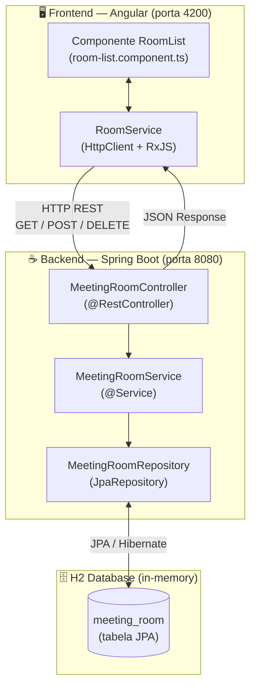
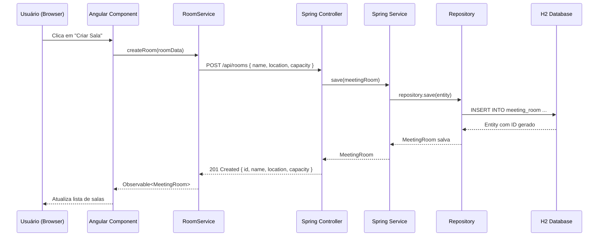
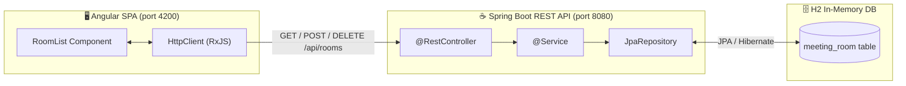

# Gerenciador de Salas de Reuniões

API REST em **Spring Boot** e SPA em **Angular** para cadastro e gerenciamento de salas de reunião, com persistência em banco H2 em memória.

Baseado nos repositórios de referência do DIO:
- https://github.com/Kamilahsantos/Client-Angular-Live-Coding-Dio
- https://github.com/kamilahsantos/Crud-Spring-liveCoding-Dio

---

## 🇧🇷 Português

### 🏗️ Arquitetura Fullstack



---

### 🔄 Fluxo de Requisição CRUD



---

### 📂 Estrutura do Projeto

```
gerenciador-salas/
├── backend/                      # API Spring Boot
│   ├── pom.xml
│   ├── src/
│   │   ├── main/
│   │   │   ├── java/com/gerenciadorsalas/
│   │   │   │   ├── controller/
│   │   │   │   │   └── MeetingRoomController.java
│   │   │   │   ├── model/
│   │   │   │   │   └── MeetingRoom.java
│   │   │   │   ├── repository/
│   │   │   │   │   └── MeetingRoomRepository.java
│   │   │   │   ├── service/
│   │   │   │   │   └── MeetingRoomService.java
│   │   │   │   └── MeetingRoomManagerApplication.java
│   │   └── resources/
│   │       └── application.properties
├── frontend/                     # SPA Angular
│   ├── package.json
│   ├── angular.json
│   ├── tsconfig.json
│   ├── src/
│   │   ├── index.html
│   │   ├── main.ts
│   │   ├── polyfills.ts
│   │   ├── styles.css
│   │   ├── environments/
│   │   │   ├── environment.ts
│   │   │   └── environment.prod.ts
│   │   └── app/
│   │       ├── app.module.ts
│   │       ├── app.component.ts
│   │       ├── room.service.ts
│   │       └── room-list/
│   │           ├── room-list.component.ts
│   │           ├── room-list.component.html
│   │           └── room-list.component.css
└── README.md
```

---

### 🚀 Tecnologias

- **Backend**
  - Java 11+
  - Spring Boot 2.x
  - Spring Data JPA
  - H2 Database (in-memory)
  - Lombok

- **Frontend**
  - Angular 10
  - TypeScript
  - RxJS
  - Angular Forms & HttpClient

---

### 🔧 Configuração & Execução

#### 1. Backend

1. Navegue até a pasta do backend:
   ```bash
   cd backend
   ```
2. Compile e execute:
   ```bash
   mvn clean spring-boot:run
   ```
3. A API estará disponível em:
   ```
   http://localhost:8080/api/rooms
   ```

#### 2. Frontend

1. Navegue até a pasta do frontend:
   ```bash
   cd frontend
   ```
2. Instale as dependências:
   ```bash
   npm install
   ```
3. Inicie em modo de desenvolvimento:
   ```bash
   ng serve
   ```
4. Acesse no navegador:
   ```
   http://localhost:4200
   ```

---

### 📦 Endpoints REST (Backend)

| Método | Rota               | Descrição                           |
| ------ | ------------------ | ----------------------------------- |
| GET    | `/api/rooms`       | Lista todas as salas                |
| GET    | `/api/rooms/{id}`  | Retorna sala por ID                 |
| POST   | `/api/rooms`       | Cria nova sala (envie JSON no body) |
| DELETE | `/api/rooms/{id}`  | Remove sala por ID                  |

**Exemplo de payload para criação**:
```json
{
  "name": "Sala de Reuniões A",
  "location": "Andar 3",
  "capacity": 10
}
```

---

### 📝 Observações

- O **banco H2** é volátil: ao reiniciar o backend, todos os dados são perdidos.
- Para usar outro banco (PostgreSQL, MySQL), ajuste o `application.properties`.
- O frontend consome diretamente o endpoint `/api/rooms`; para outra porta ou domínio, altere `apiUrl` em `environment.ts`.

---

### 📄 Licença

MIT License — sinta-se livre para usar, modificar e distribuir.

Desenvolvido como projeto de estudo e portfólio (Santander Bootcamp Fullstack Developer / DIO).

---

---

## 🇬🇧 English

### Meeting Room Manager — Spring Boot + Angular

REST API in **Spring Boot** and SPA in **Angular** for registering and managing meeting rooms, with H2 in-memory database persistence.

---

### 🏗️ Fullstack Architecture



---

### 🚀 Getting Started

#### Backend

```bash
cd backend
mvn clean spring-boot:run
# API available at http://localhost:8080/api/rooms
```

#### Frontend

```bash
cd frontend
npm install
ng serve
# App available at http://localhost:4200
```

---

### 📦 REST Endpoints

| Method | Route              | Description              |
| ------ | ------------------ | ------------------------ |
| GET    | `/api/rooms`       | List all rooms           |
| GET    | `/api/rooms/{id}`  | Get room by ID           |
| POST   | `/api/rooms`       | Create a new room        |
| DELETE | `/api/rooms/{id}`  | Delete room by ID        |

**Payload example**:
```json
{
  "name": "Conference Room A",
  "location": "3rd Floor",
  "capacity": 10
}
```

---

### 🛠️ Tech Stack

| Layer     | Technology                        |
|-----------|-----------------------------------|
| Frontend  | Angular 10, TypeScript, RxJS      |
| Backend   | Java 11, Spring Boot 2.x, Lombok  |
| Persistence | Spring Data JPA, H2 Database    |

---

### 📝 Notes

- The H2 database is in-memory and volatile: all data is lost on backend restart.
- To use a persistent database (PostgreSQL, MySQL), update `application.properties`.
- To change the API URL on the frontend, update `apiUrl` in `environment.ts`.

---

### 📄 License

MIT License — feel free to use, modify, and distribute.
